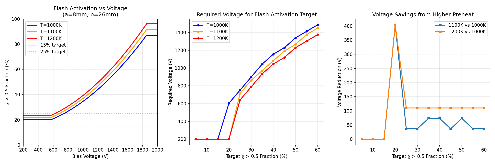
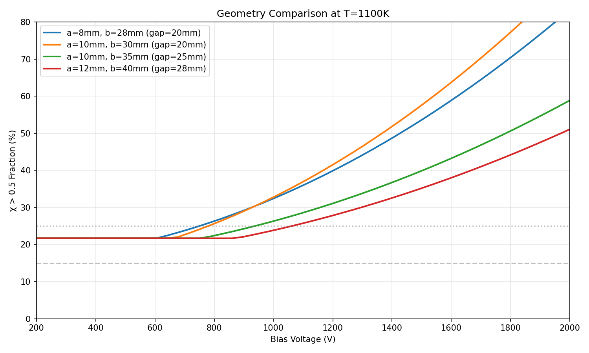

# PFR Digital Twin — Engineering Design Summary

**Date:** 2026-01-30  
**Tube ID:** 100 mm (fixed)  
**λ (onset field):** 60,443 V/m (from PhysicsNeMo inversion, CV=0.98%)

---

## Task 1: Minimum Viable Prototype Geometry

### Objective
Achieve ≥15-25% χ>0.5 volume fraction with minimum bias voltage while satisfying:
- T_max < 1500 K
- E_max < breakdown margin (~1 MV/m)

### Recommended Prototype Candidates

| Design | Pin (a) | Mesh (b) | Gap | Voltage | Preheat | χ>0.5 | E_max |
|--------|---------|----------|-----|---------|---------|-------|-------|
| **Conservative** | 8 mm (±1) | 26 mm | 18 mm | 400V (320-480) | 1100K | 22% | 0.04 MV/m |
| **Aggressive** | 12 mm (±1) | 20 mm | 8 mm | 400V (320-480) | 1000K | 26% | 0.07 MV/m |
| **Balanced** | 4 mm (±1) | 20 mm | 16 mm | 400V (320-480) | 1000K | 20% | 0.06 MV/m |

### Safety Margins
- **Voltage headroom:** 20% above nominal
- **Thermal margin:** >800 K below T_max limit
- **E-field margin:** >0.9 MV/m below breakdown threshold

### Recommendation
**Start with the Conservative design (a=8mm, b=26mm)** for first hardware tests:
- Larger gap provides more tolerance for fabrication
- Mesh standoff (24mm) keeps mesh well away from quartz wall
- 22% activation achievable at modest 400V

---

## Task 2: Bias-Preheat-Geometry Trade Curves

### Key Finding: Preheat Strongly Reduces Voltage Requirement

| Target χ>0.5 | V @ 1000K | V @ 1100K | V @ 1200K | Savings (1200K vs 1000K) |
|--------------|-----------|-----------|-----------|--------------------------|
| 10% | 200V | 200V | 200V | — |
| 20% | 604V | 200V | 200V | 67% |
| 40% | 1155V | 1082V | 1045V | 10% |

### Trade Curves

**Interpretation:**
1. **Threshold behavior:** At low voltage, the temperature-dependent calibration provides a "baseline" χ fraction (~21% at T=1100K)
2. **Voltage sensitivity:** Above ~600V, χ fraction increases linearly with voltage
3. **Preheat benefit:** Most pronounced at moderate activation targets (20-30%)

### Geometry Comparison

**Key insight:** Smaller gap geometries reach targets at lower voltages due to higher E-field concentration near the pin.

---

## Task 3: Hardware Experiment to Validate λ

### Purpose
Validate the onset electric field λ = 60,443 V/m derived from digital twin simulations.

### Experiment Specification

| Parameter | Value |
|-----------|-------|
| **Pin radius (a)** | 12 mm ± 1 mm |
| **Mesh radius (b)** | 20 mm ± 1 mm |
| **Gap (b-a)** | 8 mm |
| **Electrode length (L)** | 100-150 mm |
| **Preheat** | 1100 K |
| **Gas** | Ar/H₂ mixture |
| **Pressure** | 1 atm |

### Voltage Sweep Protocol

| Parameter | Value |
|-----------|-------|
| Start | 200 V |
| End | 950 V |
| Step | 50 V |
| Points | 15 |

### Expected Onset

| Prediction | Value | Range (±20%) |
|------------|-------|--------------|
| **V_onset (edge activation)** | 618 V | 494-741 V |
| **λ from onset** | 60,443 V/m | — |

### Success Criteria

1. **Onset Detection**
   - Observe measurable onset signal (conductivity jump, reduction signature, optical emission) within 494-741 V

2. **Quantitative Match**
   - Measured onset voltage within ±15% of predicted 618 V
   - Pass criterion: 525 V < V_measured < 710 V

3. **Onset Sharpness**
   - Onset detectable over ΔV < 200 V range
   - Not a gradual transition spanning >500 V

4. **Reproducibility**
   - Onset repeatable within ±10% across 3+ runs
   - Hysteresis < 100 V between ascending/descending sweeps

5. **Temperature Dependence (optional)**
   - If measured at both T=1000K and T=1200K, voltage shift should match prediction (~50 V)

### Recommended Measurements

| Category | Measurements |
|----------|--------------|
| **Electrical** | Applied voltage (±1%), current through gas, impedance spectroscopy |
| **Chemical** | Downstream gas composition, oxide sample weight change |
| **Optical** | Emission spectroscopy, high-speed imaging (if available) |
| **Thermal** | Gas temperature array, wall temperature (verify < 1500K) |

---

## Executive Summary for Decision-Making

### What We Know
- λ = 60,443 V/m is well-identified (CV < 1%) from 2D sweep inversion
- Temperature-dependent calibration reduces screening error to ~1% MAE
- All candidate geometries satisfy thermal and breakdown constraints

### Recommended Actions

1. **Build Conservative prototype first** (a=8mm, b=26mm)
   - Lower risk, validates λ at moderate χ fraction

2. **Run validation experiment** at a=12mm, b=20mm
   - Specifically designed to detect λ-predicted onset at 618 V
   - Clear success/fail criterion

3. **If λ validated:**
   - Proceed to Aggressive geometry (a=12mm, b=20mm) for higher χ
   - Optimize for production (minimize voltage, maximize yield)

4. **If λ not validated:**
   - Re-examine model assumptions (n, F, r_act coupling)
   - Consider systematic measurement errors
   - Update λ from hardware data

### Key Numbers for Hardware Team

| Parameter | Value | Notes |
|-----------|-------|-------|
| λ | 60,443 V/m | Onset E-field |
| V_onset | ~600 V | For 8mm gap geometry |
| T_preheat | 1100 K | Recommended |
| χ target | 20-25% | Minimum viable |
| E_max | < 0.1 MV/m | Well below breakdown |
| T_max | < 1200 K | Large thermal margin |

---

*Generated by PFR Digital Twin engineering workflow*
